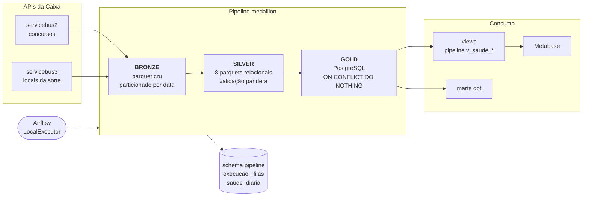

# Pipeline de dados das loterias da Caixa

[](https://github.com/DenisMilanez/projeto_airflow_loterias/actions/workflows/ci.yml)

Pipeline de engenharia de dados que coleta, trata e serve os resultados das
loterias da Caixa Econômica Federal. Arquitetura medallion (bronze, silver,
gold), orquestrado por Airflow, com PostgreSQL como camada de consumo.

O repositório já vem com **o dado bruto coletado**. Um `git clone` seguido de
`docker compose up` roda o pipeline inteiro **sem credencial, sem conta em
nuvem e sem encostar na API da Caixa**.

---

## Arquitetura



Linha cheia é fluxo de dados; pontilhada é fluxo de controle — o Airflow
dispara as tasks e cada camada registra seu estado no schema `pipeline`.

| Camada | O que faz | Onde mora |
|---|---|---|
| **Bronze** | Guarda a resposta crua da API em parquet, particionado por data de coleta | `data/bronze/{jogo}/{fonte}/AAAA/MM/DD/` |
| **Silver** | Explode o JSON aninhado em 8 parquets relacionais e valida com pandera | `data/silver/` |
| **Gold** | Carrega no PostgreSQL com cache em memória das entidades de referência | schema `public` |
| **Observabilidade** | Uma linha por execução, por arquivo e por concurso na fila | schema `pipeline` |

---

## Rodando do zero

Pré-requisitos: Docker e Python 3.11.

```bash
git clone https://github.com/DenisMilanez/projeto_airflow_loterias.git
cd projeto_airflow_loterias
cp .env.example .env.local
```

Sobe o Postgres e o Airflow:

```bash
docker compose -f airflow/docker-compose.yaml up -d
```

Instala o pacote e monta o banco a partir do bronze que veio no repositório:

```bash
python -m venv .venv && .venv/Scripts/activate
pip install -e ".[dev]"
loterias-admin db recriar --confirmar --registrar-bronze
```

Processa bronze → silver → gold:

```bash
python -m loterias.silver.concursos
python -m loterias.gold.concursos
python -m loterias.silver.locais_sorte
python -m loterias.gold.locais_sorte
```

Confere:

```bash
loterias-admin db views-aplicar
loterias-admin saude
```

O Airflow fica em `http://localhost:8081` (`admin` / `admin`). O Postgres do
projeto fica em `localhost:5433`.

Coletar da API da Caixa é o **caminho avançado**, não o padrão — só é
necessário para trazer concursos mais novos que o snapshot:

```bash
python -m loterias.bronze.concursos --modalidade MEGA_SENA
```

---

## O dataset que vem no repositório

`data/bronze/` é um snapshot datado, não um diretório que recebe commit todo
dia. Ele existe porque a coleta histórica levou cerca de 16 horas por causa do
limite de requisições da Caixa, e é dado público.

| | |
|---|---|
| Arquivos | 653 parquets |
| Tamanho | 137 MB (maior arquivo: 2,8 MB) |
| Concursos | 16.958 |
| Coleta | 27/05/2026 a 27/09/2026 |
| Fontes | `servicebus2` (concursos) e `servicebus3` (locais da sorte) |

| Modalidade | Concursos | Faixa | Período |
|---|---:|---|---|
| MEGA_SENA | 3.062 | 1–3062 | 11/03/1996 a 24/09/2026 |
| QUINA | 7.127 | 1–7127 | 13/03/1994 a 25/09/2026 |
| LOTOFACIL | 3.789 | 1–3789 | 29/09/2003 a 25/09/2026 |
| LOTOMANIA | 2.980 | 1–2980 | 02/10/1999 a 25/09/2026 |

Timemania e Dupla Sena estão fora — o motivo está em
[docs/decisoes.md](docs/decisoes.md).

Todos os valores estão em Real nominal. Os concursos 1 a 28 da Quina, de antes
do Plano Real, são convertidos de Cruzeiro Real no silver. A arrecadação por
concurso só existe a partir de 2009; antes disso fica ausente, não zero.

Processando esse bronze do zero, o gold fica assim:

| Tabela | Linhas |
|---|---:|
| `ganhador_loterica` | 3.054.637 |
| `dezena` | 170.442 |
| `rateio` | 72.171 |
| `loterica` | 48.957 |
| `concurso` | 16.958 |
| `ganhador_municipio` | 16.227 |
| `localidade` | 5.590 |
| `local_sorteio` | 694 |

O silver intermediário tem 4.499.537 linhas de `ganhador_loterica`; o gold
chega a 3.054.637 porque os arquivos bronze se sobrepõem em faixas de concurso
e a carga deduplica por `(concurso, lotérica, faixa, tipo de aposta)`.

`data/silver/` e `data/_cache/` não vão pro repositório: o silver é
reproduzível a partir do bronze em cerca de 10 minutos e o cache do IBGE
rebaixa em segundos.

Limitações conhecidas do dataset estão em
[docs/notas_dados.md](docs/notas_dados.md) — a principal é a UF truncada na
fonte.

---

## Bugs encontrados e correções aplicadas

Esta é a parte do projeto que mais me ensinou. Toda correção de dado virou
teste de regressão em `tests/`.

### 1. UF truncada com 1 caractere na fonte

O gold da Lotofácil quebrou com `KeyError: ('SANTA HELENA DE GOIAS', 'G')`.
Investigando, achei dois concursos em que a API devolve a UF com **um
caractere só** — erro de digitação no cadastro do ganhador, confirmado
consultando a URL pública da API.

| Concurso | Município | UF na API | UF correta |
|---:|---|---|---|
| LOTOFACIL 2030 | SANTA HELENA DE GOIAS | `G` | `GO` |
| LOTOFACIL 2034 | FORTALEZA | `C` | `CE` |

O estrago era maior do que parecia: `localidade.uf` é `CHAR(2)`, então o banco
grava `'G '` com espaço. Quando um arquivo mais novo traz `'GO'`, o cache do
gold não bate, a transação aborta e **todos os arquivos seguintes do mesmo job
caem em cascata** com `current transaction is aborted`.

Corrigi em duas camadas, ambas no silver:

1. **Validação defensiva** — UF que não tem exatamente 2 caracteres
   alfabéticos não é propagada.
2. **Resolução via IBGE** (`loterias/silver/ibge.py`) — baixa os 5.571
   municípios uma vez, cacheia, e resolve a UF **só quando o match é único**
   depois de filtrar pelo caractere que veio. Cidade homônima (uns 240 nomes,
   tipo "Bom Jesus" em PI/PE/PB) fica sem resolver, que é o fallback seguro.
   Município com "DIGITAL" no nome é ignorado, porque não é cidade.

O dado vai continuar errado na fonte para sempre. O pipeline é que precisa
aguentar.

### 2. Constraint UNIQUE em `local_sorteio` derrubava as modalidades seguintes

Depois que a Mega-Sena populava `local_sorteio` com nomes globais
(`CAMINHÃO DA SORTE`), Quina, Lotofácil e Lotomania quebravam com
`duplicate key value violates unique constraint`.

Corrigido em `loterias/gold/concursos.py` com
`ON CONFLICT (nome, id_localidade) DO NOTHING` no insert em lote e
`ON CONFLICT ... DO UPDATE ... RETURNING id_local_sorteio` no insert individual
— assim recupero o id sem precisar de uma query a mais.

### 3. Constraint de acertos únicos impedia a Dupla Sena

A constraint `uq_faixa_tipo_acertos (id_tipo_jogo, acertos)` bloqueava a
segunda faixa com o mesmo número de acertos. Mas a Dupla Sena tem **dois
sorteios por concurso**, cada um com faixas de 6, 5, 4 e 3 acertos — não é
único por (modalidade, acertos), nunca foi.

Removi a constraint. A unicidade real é `(id_tipo_jogo, numero_faixa)`.

### 4. UPDATE da fila levava 4 minutos por modalidade

O lote de UPDATE no fim da coleta demorava 3 a 4 minutos por modalidade. A
causa eram 3.010 UPDATEs individuais multiplicados pela latência do banco.

Separei por caso:

- **sucessos** (a maioria): uma query só, com
  `UPDATE ... WHERE numero_concurso = ANY(%s)`;
- **erros e 404** (minoria): um SELECT em massa para ler as tentativas, depois
  `execute_batch(page_size=200)`.

Resultado: **4 minutos → menos de 1 segundo** por modalidade.

### 5. Arquivos `PARCIAL` eram descartados em silêncio

O registrador de bronze usava uma expressão regular que não reconhecia o
sufixo `PARCIAL`. Três arquivos ficavam de fora sem nenhum aviso — e para os
concursos 2550, 2810 e 2955 da Mega-Sena **eles são a única cópia dos dados**:
o arquivo de faixa larga que cobre o mesmo intervalo tem zero linhas para
esses concursos.

Esses arquivos aparecem quando a API estoura o teto de paginação em concursos
de acumulado grande. O scraper salva o que conseguiu e marca o item como
terminal. Hoje a expressão reconhece o sufixo e
`tests/test_registro_bronze.py` trava o comportamento.

### 6. A DAG de saúde acusava um atraso que não existia

Quando o computador fica desligado, o scheduler acorda devendo as duas DAGs e
dispara as duas no mesmo segundo. A de saúde conferia a cobertura enquanto a
coleta ainda rodava, via os concursos novos faltando e falhava com
`modalidades atrasadas`. Dois minutos depois o pipeline terminava com tudo em
dia. Aconteceu em 19/09 e de novo em 25/09.

Alarme que dispara à toa ensina a ignorar alarme. A DAG de saúde agora começa
com um sensor que só libera o diagnóstico quando não há execução da DAG
principal na fila nem rodando. Não usei o `ExternalTaskSensor` porque ele casa
as execuções pela data lógica: um disparo manual da saúde ficaria esperando uma
execução do pipeline que nunca vai existir. O sensor roda em modo
`reschedule`, então não ocupa um slot do executor enquanto espera.

### 7. Datas do próximo sorteio misturadas entre modalidades

A API não informa `dataProximoConcurso` nos concursos antigos. O silver já
tinha uma função para isso — preencher com a data de apuração do concurso
seguinte —, mas ela ordenava os concursos **só pelo número**. Com as quatro
modalidades processadas juntas, o "seguinte" da Lotomania 1 era a Quina 2.

O estrago, sem nenhum erro nem aviso:

| Situação | Concursos |
|---|---:|
| Lotomania 1–134 com datas da Quina de 1994, cinco anos antes de a Lotomania existir | 134 |
| Mega-Sena 1–281 e Quina 1–875 sem data nenhuma | 1.156 |

O verificador de saúde mostrava os 1.156 vazios, e eu tinha classificado o
número como normal para dado histórico em vez de investigar.

Na investigação apareceu um terceiro problema, este na própria API: em 92
concursos antigos (Lotomania 178–190, Mega-Sena 325–337, Quina 892–2153) ela
devolve como próximo sorteio a **data do sorteio anterior**, deslocada uma
posição.

Corrigi em duas camadas:

1. **No silver**, a função agrupa por modalidade antes de procurar o concurso
   seguinte.
2. **No gold**, depois de cada carga, um `UPDATE` preenche a data que falta ou
   que é impossível — anterior ao próprio sorteio, ou igual a ele quando o
   seguinte não caiu no mesmo dia — com a apuração do concurso seguinte.

O que parece erro mas não é fica como veio: 49 concursos com data prevista
diferente da real porque o sorteio foi adiado, e 13 dias com dois sorteios.
Isso é informação, não defeito.

O verificador de saúde agora conta os concursos nessa situação e degrada se
houver algum. `tests/test_data_proximo.py` trava o silver, o reparo e o estado
do banco.

### 8. Cidades e locais de sorteio duplicados por erro de digitação

A normalização de nomes nasceu com a Mega-Sena: um dicionário com as variantes
exatas que apareciam ali. Quando entraram Quina, Lotofácil e Lotomania, vieram
erros de digitação que o dicionário não conhecia, e cada grafia virou uma linha
nova. Comparei as 5.667 localidades com o cadastro do IBGE: 97 estavam fora
dele. Os locais de sorteio eram 33 nomes para 11 lugares
(`ESPAÇO LOOTERIAS CAIXA`, `ESAPÇO LOTERIAS CAIXA`, `CAMINHÃO DA SORTE09`...).

| Como a localidade foi corrigida | Exemplos | Casos |
|---|---|---:|
| Semelhança com o cadastro da UF | `SAO PULO`, `SA0 PAULO` (com zero), `URBERLANDIA`, `OSACO`, `TMON` | 52 |
| Regra de escrita | `D OESTE`, `DOESTE` e `DO OESTE` por `D'OESTE`; hífen; `STO.`; `RIBEIRAO PRETO,` | 26 |
| Lista revisada: renomeação, distrito, UF trocada | `EMBU` → `EMBU DAS ARTES`; `GAMA/DF` → `BRASILIA/DF`; `BRASILIA/SP` → `BRASILIA/DF` | 16 |
| Espaço duplo | `CAMPO  GRANDE/MS`, `PORTO  VELHO/RO` | 3 |

Corrigir nome de cidade é arriscado: `SAO MIGUEL DO OESTE` é um município real,
então trocar `DO OESTE` por `D'OESTE` às cegas estraga dado bom. A correção só
acontece com evidência, na ordem:

1. **Lista revisada no YAML** para renomeações, distritos e UF trocada — cada
   uma conferida no cadastro do IBGE.
2. **Regras de escrita** (pontuação, `D'OESTE`, `STO.`, hífen), aceitas só se o
   resultado existir no IBGE.
3. **Semelhança** com o cadastro da mesma UF, aceita só acima de 0,8 **e** com
   folga de 0,05 sobre o segundo candidato.

O que não passa por nenhuma das três fica como veio. Sobrou um caso,
`VARZEA GRANDE/CE`: não existe no Ceará, e pode ser tanto a do Piauí quanto a
do Mato Grosso.

Para o local do sorteio, a comparação usa uma chave sem acento, caixa e
pontuação, então o YAML só precisa listar erro de digitação de verdade. Um
concurso trazia `QUINA` no campo do local — o nome da modalidade, não um
lugar — e ficou sem local em vez de receber um palpite.

A correção roda em dois pontos: no silver, para o dado novo já chegar certo, e
no gold, depois de cada carga, unificando o que já estava no banco. Unificar
localidade exige reapontar lotéricas, ganhadores e locais de sorteio, e quatro
lotéricas existiam duplicadas por causa da cidade escrita de dois jeitos. Nenhum
ganhador se perdeu: `ganhador_loterica` e `ganhador_municipio` terminaram com
exatamente as mesmas linhas.

O verificador de saúde degrada se aparecer nome a corrigir e lista o que ficou
fora do IBGE. `tests/test_normalizacao.py` trava as regras e a unificação.

### 9. Prêmios de 1994 em Cruzeiro Real somados como se fossem Real

O mart de resumo dizia que a Quina devolvia **94%** do que arrecadava, e que o
maior prêmio dela tinha sido de **R$ 579 milhões**. As duas coisas eram falsas.

A Quina começou em março de 1994, antes do Plano Real. Os concursos 1 a 28
têm valores em **Cruzeiro Real**, e o pipeline somava tudo como Real. Os
"R$ 579 milhões" eram CR$ 579 milhões — uns R$ 210 mil pela conversão oficial
de 2.750 CR$ para R$ 1. Esses 28 concursos inflavam o total pago pela Quina em
R$ 24,5 bilhões, mais da metade do valor.

Havia um segundo problema no mesmo número: a API só informa a arrecadação de
cada concurso a partir de meados de 2009 e devolve **zero** para os anteriores.
O pipeline gravava esse zero, e o retorno dividia prêmios desde 1994 por
arrecadação desde 2009.

A conversão acontece no silver, logo depois do dado bruto: valores de
concursos anteriores a 01/07/1994 são divididos por 2.750 (`loterias/silver/moeda.py`).
O bronze continua exatamente como a API entregou. A arrecadação zero vira
ausente, e o pandera passou a exigir arrecadação maior que zero quando
informada.

### 10. A cidade do sorteio sumia quando o local vinha em branco

O concurso só alcança a cidade através do local do sorteio. Quando a API
mandava a cidade mas deixava o nome do local vazio, não havia local para
criar, e a cidade se perdia no caminho: 393 concursos tinham a cidade no
bronze e nenhuma no banco.

Agora esses concursos recebem o local `NAO INFORMADO` na cidade certa — a mesma
convenção já usada para município vazio.

Os bugs 9 e 10 expuseram um problema de desenho no gold: a carga fazia
`ON CONFLICT DO NOTHING`, então uma correção no silver nunca chegava ao banco,
e cada correção anterior tinha precisado de um reparo escrito à mão. A carga
passou a atualizar os valores monetários e a preencher o local ausente. Com
isso, corrigir o silver e reprocessar a partir do bronze basta:

```bash
loterias-admin arquivo resetar --camada prata --fonte concursos
python -m loterias.silver.concursos
python -m loterias.gold.concursos
```

Os 17 mil concursos reprocessaram em 4 minutos, com concursos, dezenas, rateios
e ganhadores terminando com exatamente as mesmas linhas.
`tests/test_moeda_e_local.py` trava a conversão, a arrecadação e o local.

### 11. O caminho do arquivo dependia de onde o código rodou

Esse apareceu justamente no reprocessamento: 30 dos 102 arquivos falharam com
`Bronze nao encontrado`. O registro de cada parquet guardava o caminho
absoluto de quem o coletou — `D:\projetos\...` quando foi o Windows,
`/opt/loterias/...` quando foi o container do Airflow. Cada lado só conseguia
reprocessar o que ele mesmo tinha baixado.

O registro passou a guardar o caminho relativo à raiz do projeto
(`data/bronze/...`), e a leitura resolve qualquer formato, inclusive os
antigos (`loterias/caminhos.py`). Os 653 registros existentes foram
normalizados, e `tests/test_caminhos.py` trava os três formatos.

### 12. A Lotomania pagava prêmio de "0 acertos" a 27 milhões de pessoas

Montando o dashboard, a Lotomania apareceu com duas faixas chamadas
"0 acertos", uma delas com 27,6 milhões de ganhadores. Acertar zero de vinte
números é tão raro quanto acertar os vinte, então o número era impossível.

A causa: no concurso 1653 a Caixa criou a faixa de 15 acertos, deu a ela o
número 6 e empurrou o "0 acertos" para o número 7. O banco identificava cada
faixa só pelo número e guardou a primeira descrição que viu — então os
prêmios de 15 acertos de 1.328 concursos ficaram rotulados como 0 acertos.

| Concursos | Faixa 6 | Faixa 7 |
|---|---|---|
| 1 a 1652 | 0 acertos | — |
| 1653 em diante | 15 acertos | 0 acertos |

A faixa passou a ser identificada por número e acertos: a regra de
unicidade do banco virou `(id_tipo_jogo, numero_faixa, acertos)`, o silver
leva os acertos junto de cada prêmio, e o gold liga o prêmio à faixa certa.
Os rateios da Lotomania foram apagados e recarregados do bronze — 72.171
linhas antes e depois, com o mesmo total de ganhadores e o mesmo valor pago.

O mart de premiação passou a ter uma linha por número de acertos, então os
dois "0 acertos" viram um só para quem lê. O teste que pegou o bug é simples:
nenhum concurso pode ter duas faixas com os mesmos acertos
(`tests/test_faixa_renumerada.py`).

---

## CLI de administração

Toda operação de manutenção passa por um comando só. A lógica mora em funções
importáveis dentro de `loterias/admin/`; o Typer é casca fina por cima — as
DAGs e os testes chamam as mesmas funções.

```
loterias-admin fila status     [--fonte concursos|locais_sorte] [--modalidade X]
loterias-admin fila erros      [--fonte Y] [--modalidade X] [--limite N]
loterias-admin fila detalhe    [--fonte Y] [--modalidade X]
                               [--status erro|processando|abandonado] [--limite N]
loterias-admin fila resetar    --de erro|processando|abandonado
                               [--modalidade X | --todas] [--fonte Y]
                               [--dias N] [--manter-tentativas] [--dry-run]

loterias-admin arquivo resetar --camada prata|ouro [--id-inicio N --id-fim N]
                               [--fonte concursos|locais_sorte] [--dry-run]

loterias-admin db testar
loterias-admin db catalogo     [--bancos]
loterias-admin db recriar      --confirmar [--registrar-bronze]
loterias-admin db limpar       --confirmar
loterias-admin db views-aplicar

loterias-admin saude           [--modalidade X] [--completo]
loterias-admin dados backup    [--destino PASTA] [--limpar-origem]
loterias-admin dados catalogo-gerar
```

`--de` e `--status` aceitam repetição, então
`fila resetar --de erro --de abandonado` resolve os dois numa passada.

O `saude` vai além da cobertura: confere lacunas na sequência de concursos,
concursos sem `numero_concurso_anterior`, data do próximo sorteio ausente ou
impossível, nomes de município e de local do sorteio fora do padrão, e a
integridade do schema — colunas esperadas, constraints de unicidade e
duplicatas nas chaves naturais de cada tabela. Devolve código de saída diferente de zero quando algo disso falha, por
isso serve como task no Airflow e passo no CI.

`fila erros` agrupa as mensagens de erro por frequência, e `fila detalhe` lista
item a item com tentativas e horário do próximo retry — é o que responde "por
que essa modalidade parou".

Três regras que valem para todos os comandos:

- **`--dry-run` em tudo que escreve**, mostrando a contagem antes de aplicar;
- **`--confirmar` obrigatório no destrutivo**;
- **nenhuma modalidade com valor padrão silencioso** — ou `--modalidade`, ou
  `--todas`, ou o comando recusa.

A última regra nasceu de um bug real: sete scripts de manutenção só enxergavam
a Mega-Sena — cinco com `modalidade = 'MEGA_SENA'` cravado no SQL, dois numa
constante no topo do arquivo. Rodar para a Quina não dava erro — simplesmente
não fazia nada, em silêncio.

---

## Orquestração

| DAG | Agenda | O que faz |
|---|---|---|
| `loterias_pipeline_diario` | 03:00 UTC | Coleta incremental: bronze, silver e gold das duas fontes |
| `loterias_setup_inicial` | manual | Cria as tabelas e o seed dos tipos de jogo |
| `loterias_admin_fila_resetar` | manual | Formulário para devolver itens travados à fila |
| `loterias_admin_saude` | 12:00 UTC | Espera a DAG principal terminar e diagnostica; falha a task quando o pipeline está degradado |

Na DAG principal as modalidades são encadeadas nas duas fontes — uma de cada
vez, nunca quatro em paralelo. As APIs da Caixa limitam por janela de tempo, e
quatro tasks simultâneas com semáforo de 3 viram 12 requisições concorrentes.
O caso real que levou a isso está em [docs/decisoes.md](docs/decisoes.md).

As DAGs de administração usam `params`, então o formulário "Trigger DAG w/
config" sai pronto, com validação, log de cada execução e histórico de quem
rodou o quê e quando.

---

## Qualidade

```bash
ruff check loterias tests airflow
ruff format --check loterias tests airflow
pytest -q                  # tudo
pytest -q -m integracao    # só o que precisa de banco
```

O CI roda lint, formatação, a suíte inteira contra um PostgreSQL de serviço, e
carrega as DAGs num `DagBag` falhando se alguma quebrar.

A camada silver é validada com **pandera** antes de promover pro gold: schema
esperado, faixas de valores, nulos e unicidade. Por padrão a validação relata;
com `LOTERIAS_QUALIDADE_ESTRITA=1` ela interrompe a carga.

---

## Camada analítica em dbt

Em cima do gold, quatro marts com testes e lineage. O Python faz o que exige
rede, retry e estado; o dbt faz o SQL declarativo.

```bash
pip install -e ".[dbt]"
cd dbt && dbt deps && dbt build
```

| Mart | Grão |
|---|---|
| `mart_resumo_modalidade` | modalidade |
| `mart_ganhadores_municipio` | uf + município + modalidade |
| `mart_premiacao_faixa` | modalidade + acertos |
| `mart_serie_mensal` | modalidade + mês |

São 33 testes dbt: `unique`, `not_null`, `relationships`,
`unique_combination_of_columns`, `accepted_range` e `expression_is_true`. Detalhes em
[dbt/README.md](dbt/README.md).

O retorno em prêmios compara prêmios e arrecadação só nos concursos que têm os
dois, porque a Caixa só informa a arrecadação a partir de 2009. O mart de
premiação traz média e mediana do prêmio por ganhador: na faixa principal da
Quina a média é R$ 1,41 milhão e a mediana R$ 161 mil, porque poucos prêmios
gigantes puxam a média para cima. O próprio dbt
concede leitura ao usuário `metabase`, que é o que ferramentas de BI usam.

---

## Estrutura

```
loterias/
├── bronze/          scrapers assíncronos das duas APIs
├── silver/          transformação, módulo IBGE e validação pandera
├── gold/            carga no PostgreSQL
├── schema/          DDL dos schemas public e pipeline
├── admin/           operações de manutenção e o CLI
├── sql/             views de saúde
├── caminhos.py      resolução de caminhos do projeto
├── db.py            conexão, perfis e pool
├── config.py        leitura do YAML
├── http.py          cabeçalhos HTTP das duas APIs
├── pipeline.py      execução ponta a ponta fora do Airflow
├── orquestrador.py  execução multi-modalidade fora do Airflow
└── log.py           logger uniforme

airflow/             Dockerfile, compose e DAGs
config/              loterias.yaml
data/bronze/         snapshot versionado
docs/                catálogo, decisões e notas de dados
dbt/                 staging e marts analíticos
tests/               testes de regressão e de qualidade
```

---

## Configuração

Tudo por `.env.local`, nada no código:

```
LOTERIAS_DB_PERFIL=local        # local (Docker, sem SSL) ou gerenciado (SSL + CA)
LOTERIAS_DB_HOST=localhost
LOTERIAS_DB_PORT=5433
LOTERIAS_DB_NOME=loterias
LOTERIAS_DB_USUARIO=loterias
LOTERIAS_DB_SENHA=loterias
```

Parâmetros de coleta por modalidade — ritmo de requisição, tamanho de lote,
escada de backoff, dias de sorteio — ficam em `config/loterias.yaml`.

---

## Documentação

- [docs/decisoes.md](docs/decisoes.md) — por que o pipeline é do jeito que é
- [docs/notas_dados.md](docs/notas_dados.md) — peculiaridades das APIs da Caixa
- [docs/catalogo_dados.md](docs/catalogo_dados.md) — catálogo do schema `public`, gerado automaticamente

---

## Stack

Python 3.11+, Airflow 2.9, PostgreSQL 16, pandas, pyarrow, aiohttp, psycopg2,
pandera, Typer, dbt, Metabase, Docker Compose, GitHub Actions.
